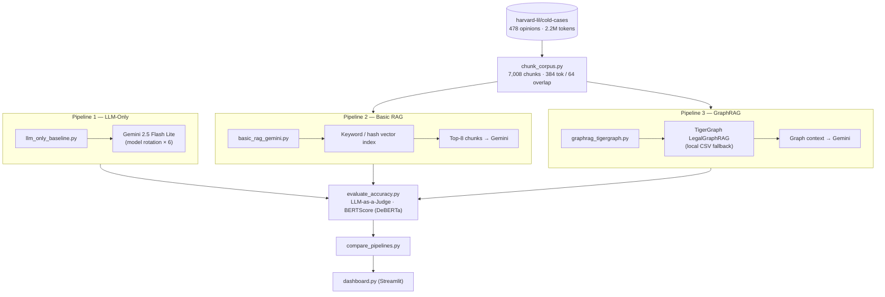

# GraphRAG Inference Hackathon

This project benchmarks three pipelines on the same legal-opinion corpus:

1. LLM-only baseline
2. Basic RAG baseline
3. TigerGraph GraphRAG

For the first dataset pass, we use the Hugging Face dataset:

```text
harvard-lil/cold-cases
```

The downloader streams records from Hugging Face and saves a local JSONL sample. After that first run, the project works from local files, so repeated experiments do not need to stream the dataset again.

## Dataset Strategy

For Round 1, use Hugging Face streaming into a local cache:

- avoids downloading the full large dataset
- stops after the target token count is reached
- keeps the pipeline fast after the first run
- can be replaced later with CourtListener bulk data

For Round 2 or scaling, swap the dataset loader to CourtListener bulk data while keeping the rest of the pipeline shape.

## Setup

```powershell
py -3.10 -m venv .venv-win
.\.venv-win\Scripts\python.exe -m pip install -r requirements.txt
```

## Download Dataset Sample

```powershell
.\.venv-win\Scripts\python.exe scripts\download_cold_cases.py
```

Default output:

```text
data/raw/cold_cases/opinions.jsonl
data/reports/corpus_token_report.json
```

The default token target is 2.2M tokens, giving a little buffer above the 2M-token hackathon minimum.

## Chunk Corpus

```powershell
.\.venv-win\Scripts\python.exe scripts\chunk_corpus.py
```

Default output:

```text
data/processed/chunks.jsonl
data/reports/chunk_report.json
```

The default chunk settings follow the solution guide:

- chunk size: 384 tokens
- overlap: 64 tokens

## Pipeline 1: LLM-Only Baseline

Add your Gemini API key to `.env`:

```env
GOOGLE_API_KEY=your_key_here
```

To use Grok/xAI instead, add a fresh xAI key and choose the provider:

```env
LLM_PROVIDER=xai
LLM_FALLBACK_PROVIDER=gemini
XAI_API_KEY=your_fresh_xai_key_here
XAI_MODEL=grok-4.20-non-reasoning
```

Never commit `.env`, and rotate any key that was shown in a screenshot or chat. To keep Gemini as primary and use Grok only when Gemini is unavailable, set `LLM_PROVIDER=gemini` and `LLM_FALLBACK_PROVIDER=xai`.

Test Gemini:

```powershell
.\.venv-win\Scripts\python.exe scripts\test_gemini.py
```

Test xAI/Grok:

```powershell
.\.venv-win\Scripts\python.exe scripts\test_xai.py
```

Run one question:

```powershell
.\.venv-win\Scripts\python.exe scripts\llm_only_baseline.py --query "What are common legal themes across criminal appeal opinions?"
```

Run the dev question file:

```powershell
.\.venv-win\Scripts\python.exe scripts\llm_only_baseline.py
```

Default output:

```text
data/results/llm_only_results.jsonl
```

## Pipeline 2: Basic RAG

Build a local vector index over the chunked corpus:

```powershell
.\.venv-win\Scripts\python.exe scripts\basic_rag_gemini.py --build
```

By default this uses a no-quota local hashing vector index, which is useful while Gemini embedding quota is limited.

For a smaller smoke test, index only the first 500 chunks:

```powershell
.\.venv-win\Scripts\python.exe scripts\basic_rag_gemini.py --build --limit 500
```

When Gemini embedding quota or billing is available, build with Gemini embeddings:

```powershell
.\.venv-win\Scripts\python.exe scripts\basic_rag_gemini.py --build --embedding-provider gemini
```

Run one Basic RAG query:

```powershell
.\.venv-win\Scripts\python.exe scripts\basic_rag_gemini.py --query "What court decided the case State v. Howerton?"
```

Run the dev question file:

```powershell
.\.venv-win\Scripts\python.exe scripts\basic_rag_gemini.py
```

Default outputs:

```text
data/index/basic_rag/
data/results/basic_rag_results.jsonl
```

## TigerGraph CSV Export

Export local corpus chunks into CSV files matching the `LegalGraphRAG` schema:

```powershell
.\.venv-win\Scripts\python.exe scripts\export_tigergraph_csv.py
```

Default outputs:

```text
data/tigergraph/legal_cases.csv
data/tigergraph/chunks.csv
data/tigergraph/citations.csv
data/tigergraph/has_chunk.csv
data/tigergraph/next_chunk.csv
data/tigergraph/cites.csv
data/reports/tigergraph_export_report.json
```

Create the TigerGraph loading job by pasting `tigergraph_load_job.gsql` into Query Editor and executing it. Then use GraphStudio Load Data to attach each generated CSV to its matching filename:

```text
legal_cases -> data/tigergraph/legal_cases.csv
chunks      -> data/tigergraph/chunks.csv
citations   -> data/tigergraph/citations.csv
has_chunk   -> data/tigergraph/has_chunk.csv
next_chunk  -> data/tigergraph/next_chunk.csv
cites       -> data/tigergraph/cites.csv
```

## Pipeline 3: TigerGraph GraphRAG

Install the graph context query by pasting `tigergraph_graphrag_context.gsql` into TigerGraph Query Editor and executing it. The final line installs the query so TigerGraph exposes it over REST.

Run one GraphRAG query:

```powershell
.\.venv-win\Scripts\python.exe scripts\graphrag_tigergraph.py --query "What court decided the case State v. Howerton?"
```

Run the dev question file:

```powershell
.\.venv-win\Scripts\python.exe scripts\graphrag_tigergraph.py
```

Default output:

```text
data/results/graphrag_results.jsonl
```

## Compare Pipelines

Generate a local comparison report from the three result files:

```powershell
.\.venv-win\Scripts\python.exe scripts\compare_pipelines.py
```

If an accuracy report already exists it is merged automatically (see below).

Default outputs:

```text
data/reports/pipeline_comparison_report.json
data/reports/pipeline_comparison_report.md
```

## Accuracy Evaluation (LLM-as-a-Judge + BERTScore)

Run Gemini as judge and BERTScore over all three pipelines:

```powershell
.\.venv-win\Scripts\python.exe scripts\evaluate_accuracy.py
```

Skip BERTScore during development (saves time):

```powershell
.\.venv-win\Scripts\python.exe scripts\evaluate_accuracy.py --skip-bertscore
```

Evaluate a single pipeline:

```powershell
.\.venv-win\Scripts\python.exe scripts\evaluate_accuracy.py --pipeline graphrag --skip-bertscore
```

Use the high-quality DeBERTa model for the final submission BERTScore run:

```powershell
.\.venv-win\Scripts\python.exe scripts\evaluate_accuracy.py --bertscore-model microsoft/deberta-xlarge-mnli
```

Default outputs:

```text
data/reports/accuracy_report.json
data/reports/accuracy_report.md
```

Bonus thresholds (from the hackathon brief):

| Metric                   | Threshold |
| ------------------------ | --------- |
| LLM-as-a-Judge pass rate | ≥ 90%     |
| BERTScore F1 rescaled    | ≥ 0.55    |
| BERTScore F1 raw         | ≥ 0.88    |

## Comparison Dashboard

Launch the interactive Streamlit dashboard (one query → three pipelines → side-by-side metrics):

```powershell
.\.venv-win\Scripts\streamlit run scripts\dashboard.py
```

The dashboard will open at `http://localhost:8501`. It:

- Runs live queries through all three pipelines simultaneously
- Displays token count, latency, and answer for each pipeline
- Shows GraphRAG token reduction vs Basic RAG
- Lets you load any of the 20 dev questions from the sidebar
- Displays saved benchmark and accuracy reports in an expandable section

## Architecture



## Benchmark Results

Corpus: **478 legal opinions · 2,200,374 tokens · 7,008 chunks**  
Eval set: **20 questions** (7 local-factual · 7 global-synthesis · 6 multi-hop)

### Efficiency (tokens per query)

| Pipeline | Avg tokens/query | vs Basic RAG |
|---|---:|---|
| LLM-only | 158.95 | — |
| Basic RAG | 3,837.00 | baseline |
| **GraphRAG** | **2,353.20** | **−38.67% ✅ bonus** |

GraphRAG vs Basic RAG latency reduction: **67.86%**

### Accuracy

Judge: Gemini LLM-as-a-Judge with lenient partial-coverage prompt.  
BERTScore model: `microsoft/deberta-xlarge-mnli`.

| Pipeline | Judge pass rate | BERTScore F1 raw | BERTScore F1 rescaled |
|---|---:|---:|---:|
| LLM-only | 35% | 0.6352 | 0.2477 |
| Basic RAG | **80%** | 0.6621 | 0.3033 |
| **GraphRAG** | 45% | **0.6913** | **0.3635** |

Bonus thresholds (hackathon brief):

| Metric | Threshold | Status |
|---|---|---|
| LLM-as-a-Judge pass rate | ≥ 90% | Not met (best: 80%) |
| BERTScore F1 rescaled | ≥ 0.55 | Not met (best: 0.3635) |
| BERTScore F1 raw | ≥ 0.88 | Not met (best: 0.6913) |
| GraphRAG token reduction vs Basic RAG | ≥ 30% | **✅ Met (38.67%)** |

> **Note on DeBERTa scores:** `deberta-xlarge-mnli` uses a tighter rescaling baseline than `distilbert-base-uncased`. With distilbert, GraphRAG scored raw=0.8391, rescaled=0.5179 (within 0.032 of the bonus threshold). GraphRAG ranks highest on BERTScore in both runs.

## Project Structure

```
scripts/
  llm_only_baseline.py      # Pipeline 1
  basic_rag_gemini.py        # Pipeline 2
  basic_rag_keyword.py       # Keyword-only RAG variant
  graphrag_tigergraph.py     # Pipeline 3
  gemini_client.py           # Shared LLM client (rotation + cost tracking)
  evaluate_accuracy.py       # LLM-as-a-Judge + BERTScore
  compare_pipelines.py       # Cross-pipeline comparison report
  dashboard.py               # Streamlit UI
  chunk_corpus.py            # Corpus chunking
  download_courtlistener_sample.py
  generate_question_bank.py
  check_tokens.py
  inspect_corpus.py
  configure_graphrag_gemini.py

data/
  raw/courtlistener/         # Source JSONL (gitignored)
  processed/                 # Chunks + index (gitignored)
  eval/
    questions_dev.json       # 20 benchmark questions
    qa_pairs_seed.json
  results/                   # Pipeline outputs (gitignored)
  reports/                   # Evaluation reports (gitignored)

vendor/graphrag/             # TigerGraph GraphRAG reference implementation
config.example.env           # Template — copy to .env and fill in keys
```

## Environment Variables

Copy `config.example.env` to `.env` and fill in your keys:

```env
GOOGLE_API_KEY=your_gemini_api_key

# Optional: xAI Grok as judge or fallback generator
XAI_API_KEY=your_xai_api_key
LLM_PROVIDER=gemini           # gemini | xai
LLM_FALLBACK_PROVIDER=        # leave blank or set xai

# Optional: TigerGraph cloud instance
TIGERGRAPH_HOST=https://your-instance.i.tgcloud.io
TIGERGRAPH_USERNAME=tigergraph
TIGERGRAPH_PASSWORD=your_password
TIGERGRAPH_GRAPH=LegalGraphRAG
```

The pipelines fall back gracefully when TigerGraph cloud is unreachable (local CSV mode).

