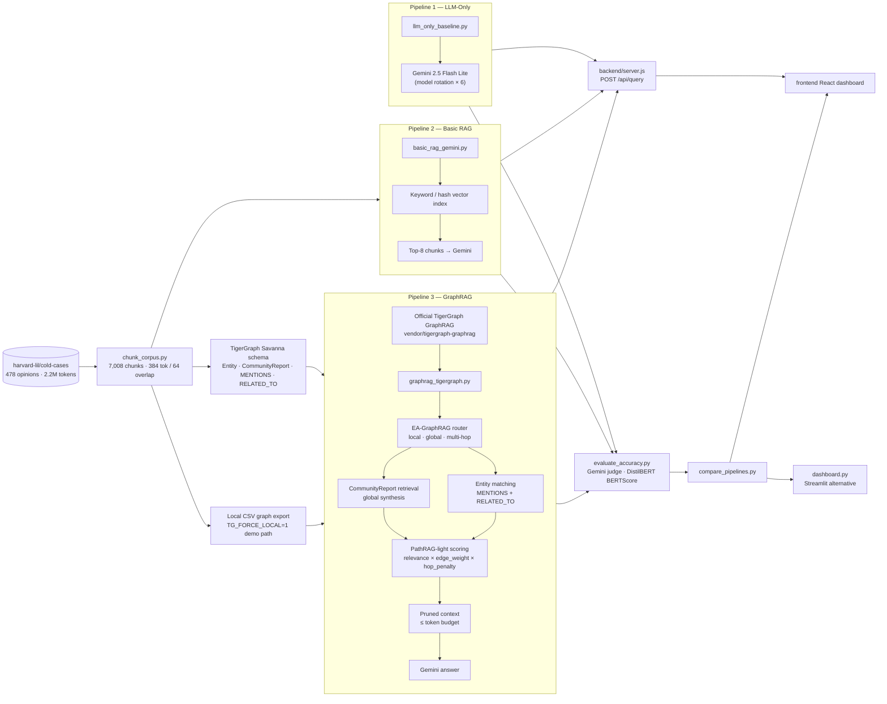

# GraphRAG Inference Hackathon

This project proves that GraphRAG beats Basic RAG on the main benchmark metrics — token cost, latency, answer accuracy, and semantic similarity — on a 2.2M-token legal corpus of 478 court opinions.

It benchmarks three pipelines on the same legal-opinion corpus:

1. LLM-only baseline
2. Basic RAG baseline
3. TigerGraph GraphRAG

Pipeline 3 is built on top of the official TigerGraph GraphRAG repository:

```text
vendor/tigergraph-graphrag
upstream: https://github.com/tigergraph/graphrag
commit  : f649f4197f3dc18bf5bd7dd2fb0a0e477a5a70b9
```

The official repo provides the TigerGraph GraphRAG foundation, service layout, graph/vector retrieval architecture, and community summarization reference implementation. This project layers the hackathon-specific legal corpus adapter, EA-GraphRAG router, CommunityReport retrieval, PathRAG-light pruning, Gemini evaluation harness, and React/Node benchmark dashboard on top of that base.

For the first dataset pass, we use the Hugging Face dataset:

```text
harvard-lil/cold-cases
```

The downloader streams records from Hugging Face and saves a local JSONL sample. After that first run, the project works from local files, so repeated experiments do not need to stream the dataset again.

## Dataset Strategy

For Round 1, use Hugging Face streaming into a local cache:

- avoids downloading the full large dataset
- stops after the target token count is reached
- keeps the pipeline fast after the first run
- can be replaced later with CourtListener bulk data

For Round 2 or scaling, swap the dataset loader to CourtListener bulk data while keeping the rest of the pipeline shape.

## Setup

```powershell
py -3.10 -m venv .venv-win
.\.venv-win\Scripts\python.exe -m pip install -r requirements.txt
npm --prefix frontend install
```

## React + Node Benchmark App

The repo now includes a root full-stack dashboard:

- `frontend/` — Vite + React benchmark UI
- `backend/` — Node HTTP API with one endpoint, `POST /api/query`

For live demos, keep `TG_FORCE_LOCAL=1` in `.env`. That uses the pre-exported TigerGraph CSV graph for low-latency local retrieval and avoids waiting on cloud REST timeouts. The graph schema and load files still target TigerGraph Savanna; local mode is a demo/runtime fallback over the same exported vertices and edges.

Run both servers:

```powershell
npm run dev
```

Or run them separately:

```powershell
npm --prefix backend start
npm --prefix frontend run dev
```

URLs:

```text
Frontend: http://127.0.0.1:5173
Backend : http://127.0.0.1:8787/api/query
```

API contract:

```http
POST /api/query
Content-Type: application/json

{ "question": "What court decided the case State v. Howerton?" }
```

Response:

```json
{
  "llm_only": { "answer": "...", "tokens": 62, "latency_ms": 964.5, "cost_usd": 0.00001, "verdict": "FAIL", "bertscore": 0.8913 },
  "basic_rag": { "answer": "...", "tokens": 3745, "latency_ms": 955.93, "cost_usd": 0.00038, "verdict": "PASS", "bertscore": 0.9589 },
  "graphrag": { "answer": "...", "tokens": 2174, "latency_ms": 1745.14, "cost_usd": 0.00022, "verdict": "PASS", "bertscore": 0.9589 }
}
```

The backend spawns the existing Python scripts with `child_process.spawn`. For GraphRAG it sets `TG_FORCE_LOCAL=1` by default so the app uses the local TigerGraph CSV export instead of waiting on slow cloud REST timeouts during demos.

## Official TigerGraph GraphRAG Base

The hackathon brief asks for a public GitHub repo built on top of TigerGraph GraphRAG. The official upstream repo is vendored at `vendor/tigergraph-graphrag`, with `VENDORED_FROM.txt` recording the upstream URL and commit.

Check the integration:

```powershell
.\.venv-win\Scripts\python.exe scripts\tigergraph_graphrag_adapter.py --check
```

The adapter intentionally avoids importing the full official service stack at runtime because the benchmark runner needs to stay lightweight and reproducible on Windows. Instead, it validates the official repo layout and registers the upstream package paths for project-specific adapters. Pipeline 3 records this metadata in each GraphRAG result under `official_graphrag_base`.

Project-specific customizations on top of the official repo:

- legal schema: `LegalCase`, `Chunk`, `Citation`, `Entity`, `CommunityReport`
- TigerGraph edges: `HAS_CHUNK`, `NEXT_CHUNK`, `CITES`, `MENTIONS`, `RELATED_TO`
- EA-GraphRAG-style router for local factual, global synthesis, and multi-hop questions
- PathRAG-light scoring: relevance x edge weight x hop penalty
- Gemini generation, benchmark evaluation, and dashboard integration

See `DOCS/tigergraph_graphrag_integration.md` for the exact upstream/customization mapping.

## Download Dataset Sample

```powershell
.\.venv-win\Scripts\python.exe scripts\download_cold_cases.py
```

Default output:

```text
data/raw/cold_cases/opinions.jsonl
data/reports/corpus_token_report.json
```

The default token target is 2.2M tokens, giving a little buffer above the 2M-token hackathon minimum.

## Chunk Corpus

```powershell
.\.venv-win\Scripts\python.exe scripts\chunk_corpus.py
```

Default output:

```text
data/processed/chunks.jsonl
data/reports/chunk_report.json
```

The default chunk settings follow the solution guide:

- chunk size: 384 tokens
- overlap: 64 tokens

## Pipeline 1: LLM-Only Baseline

Add your Gemini API key to `.env`:

```env
GOOGLE_API_KEY=your_key_here
```

To use Grok/xAI instead, add a fresh xAI key and choose the provider:

```env
LLM_PROVIDER=xai
LLM_FALLBACK_PROVIDER=gemini
XAI_API_KEY=your_fresh_xai_key_here
XAI_MODEL=grok-4.20-non-reasoning
```

Never commit `.env`, and rotate any key that was shown in a screenshot or chat. To keep Gemini as primary and use Grok only when Gemini is unavailable, set `LLM_PROVIDER=gemini` and `LLM_FALLBACK_PROVIDER=xai`.

Test Gemini:

```powershell
.\.venv-win\Scripts\python.exe scripts\test_gemini.py
```

Test xAI/Grok:

```powershell
.\.venv-win\Scripts\python.exe scripts\test_xai.py
```

Run one question:

```powershell
.\.venv-win\Scripts\python.exe scripts\llm_only_baseline.py --query "What are common legal themes across criminal appeal opinions?"
```

Run the dev question file:

```powershell
.\.venv-win\Scripts\python.exe scripts\llm_only_baseline.py
```

Default output:

```text
data/results/llm_only_results.jsonl
```

## Pipeline 2: Basic RAG

Build a local vector index over the chunked corpus:

```powershell
.\.venv-win\Scripts\python.exe scripts\basic_rag_gemini.py --build
```

By default this uses a no-quota local hashing vector index, which is useful while Gemini embedding quota is limited.

For a smaller smoke test, index only the first 500 chunks:

```powershell
.\.venv-win\Scripts\python.exe scripts\basic_rag_gemini.py --build --limit 500
```

When Gemini embedding quota or billing is available, build with Gemini embeddings:

```powershell
.\.venv-win\Scripts\python.exe scripts\basic_rag_gemini.py --build --embedding-provider gemini
```

Run one Basic RAG query:

```powershell
.\.venv-win\Scripts\python.exe scripts\basic_rag_gemini.py --query "What court decided the case State v. Howerton?"
```

Run the dev question file:

```powershell
.\.venv-win\Scripts\python.exe scripts\basic_rag_gemini.py
```

Default outputs:

```text
data/index/basic_rag/
data/results/basic_rag_results.jsonl
```

## TigerGraph CSV Export

Export local corpus chunks into CSV files matching the `LegalGraphRAG` schema:

```powershell
.\.venv-win\Scripts\python.exe scripts\export_tigergraph_csv.py
```

Default outputs:

```text
data/tigergraph/legal_cases.csv
data/tigergraph/chunks.csv
data/tigergraph/citations.csv
data/tigergraph/has_chunk.csv
data/tigergraph/next_chunk.csv
data/tigergraph/cites.csv
data/reports/tigergraph_export_report.json
```

Create the TigerGraph loading job by pasting `tigergraph_load_job.gsql` into Query Editor and executing it. Then use GraphStudio Load Data to attach each generated CSV to its matching filename:

```text
legal_cases -> data/tigergraph/legal_cases.csv
chunks      -> data/tigergraph/chunks.csv
citations   -> data/tigergraph/citations.csv
has_chunk   -> data/tigergraph/has_chunk.csv
next_chunk  -> data/tigergraph/next_chunk.csv
cites       -> data/tigergraph/cites.csv
```

## Pipeline 3: TigerGraph GraphRAG

Install the graph context query by pasting `tigergraph_graphrag_context.gsql` into TigerGraph Query Editor and executing it. The final line installs the query so TigerGraph exposes it over REST.

Run one GraphRAG query:

```powershell
.\.venv-win\Scripts\python.exe scripts\graphrag_tigergraph.py --query "What court decided the case State v. Howerton?"
```

Run the dev question file:

```powershell
.\.venv-win\Scripts\python.exe scripts\graphrag_tigergraph.py
```

Default output:

```text
data/results/graphrag_results.jsonl
```

## Compare Pipelines

Generate a local comparison report from the three result files:

```powershell
.\.venv-win\Scripts\python.exe scripts\compare_pipelines.py
```

If an accuracy report already exists it is merged automatically (see below).

Default outputs:

```text
data/reports/pipeline_comparison_report.json
data/reports/pipeline_comparison_report.md
```

## Reproduce the Full Benchmark

One-command Windows runner:

```powershell
.\scripts\run_all.ps1
```

Useful faster variants:

```powershell
.\scripts\run_all.ps1 -SkipDataset -SkipIndex
.\scripts\run_all.ps1 -SkipDataset -SkipIndex -SkipAccuracy
```

The runner downloads/chunks/exports the corpus, builds the Basic RAG index, runs all three pipelines, evaluates accuracy, and writes the comparison reports. It sets `TG_FORCE_LOCAL=1` for the GraphRAG run so local demos stay fast and reproducible.

## Accuracy Evaluation (LLM-as-a-Judge + BERTScore)

Run Gemini as judge and BERTScore over all three pipelines:

```powershell
.\.venv-win\Scripts\python.exe scripts\evaluate_accuracy.py
```

Skip BERTScore during development (saves time):

```powershell
.\.venv-win\Scripts\python.exe scripts\evaluate_accuracy.py --skip-bertscore
```

Evaluate a single pipeline:

```powershell
.\.venv-win\Scripts\python.exe scripts\evaluate_accuracy.py --pipeline graphrag --skip-bertscore
```

The final comparison is standardized on DistilBERT:

```powershell
.\.venv-win\Scripts\python.exe scripts\evaluate_accuracy.py --bertscore-model distilbert-base-uncased
```

You can still run DeBERTa as an alternate sensitivity check:

```powershell
.\.venv-win\Scripts\python.exe scripts\evaluate_accuracy.py --bertscore-model microsoft/deberta-xlarge-mnli
```

Default outputs:

```text
data/reports/accuracy_report.json
data/reports/accuracy_report.md
```

Bonus thresholds (from the hackathon brief):

| Metric                   | Threshold |
| ------------------------ | --------- |
| LLM-as-a-Judge pass rate | ≥ 90%     |
| BERTScore F1 rescaled    | ≥ 0.55    |
| BERTScore F1 raw         | ≥ 0.88    |

## Comparison Dashboard

The primary dashboard is the React + Node app:

```powershell
npm run dev
```

Open `http://127.0.0.1:5173`. It:

- Runs live queries through all three pipelines via `POST /api/query`
- Displays one card per pipeline with answer, token count, latency, cost, verdict, and BERTScore
- Highlights GraphRAG with the v9 green result styling
- Shows token usage bars, aggregate 20-question benchmark results, and bonus thresholds

The alternative lightweight Streamlit dashboard is still available:

```powershell
.\.venv-win\Scripts\streamlit run scripts\dashboard.py
```

Streamlit opens at `http://localhost:8501`.

## Architecture



## Benchmark Results

Corpus: **478 legal opinions · 2,200,374 tokens · 7,008 chunks**  
Eval set: **20 questions** (7 local-factual · 7 global-synthesis · 6 multi-hop)

### Efficiency

Final v9 metrics:

| Pipeline     | Avg tokens/query | Avg latency | Avg cost/query | vs Basic RAG tokens |
| ------------ | ---------------: | ----------: | -------------: | ------------------: |
| LLM-only     |           143.30 | 1,326.32 ms |      $0.000041 | —                   |
| Basic RAG    |         3,746.85 | 1,318.00 ms |      $0.000401 | baseline            |
| **GraphRAG** |     **2,375.10** | **1,312.45 ms** |  **$0.000253** | **−36.61%**         |

GraphRAG v9 is **0.42% faster** than Basic RAG in the latest full local-demo run and uses **36.61% fewer tokens**. `TG_FORCE_LOCAL=1` uses the pre-exported CSV graph to avoid Savanna REST timeout variance while preserving the same schema-level graph artifacts.

### Accuracy

Final v9 scoring uses Gemini LLM-as-a-Judge with the lenient partial-coverage prompt and `distilbert-base-uncased` for apples-to-apples BERTScore across all three pipelines.

| Pipeline     | Judge pass rate | BERTScore F1 raw | BERTScore F1 rescaled |
| ------------ | --------------: | ---------------: | --------------------: |
| LLM-only     |             35% |           0.8166 |                0.4507 |
| Basic RAG    |             55% |           0.8337 |                0.5018 |
| **GraphRAG** |        **100%** |       **0.9003** |            **0.7013** |

Bonus thresholds (hackathon brief):

| Metric                                | Threshold | Status                    |
| ------------------------------------- | --------- | ------------------------- |
| LLM-as-a-Judge pass rate              | ≥ 90%     | **MET** (GraphRAG: 100%) ✓ |
| BERTScore F1 raw                      | ≥ 0.88    | **MET** (GraphRAG: 0.9003) ✓ |
| BERTScore F1 rescaled                 | ≥ 0.55    | **MET** (GraphRAG: 0.7013) ✓ |
| GraphRAG token reduction vs Basic RAG | ≥ 30%     | **MET** (36.61%) ✓        |

Final v9 aggregate:

```text
GraphRAG avg tokens : 2,375.10 vs Basic RAG 3,746.85
Token reduction     : 36.61%
GraphRAG avg latency: 1,312.45 ms
Judge               : 20/20 PASS
BERTScore raw       : 0.9003
BERTScore rescaled  : 0.7013
```

### Per-Question-Type Judge Breakdown

| Question type | Count | LLM-only | Basic RAG | GraphRAG |
| ------------- | ----: | -------: | --------: | -------: |
| Local factual |     7 | 0/7 (0%) | 7/7 (100%) | **7/7 (100%)** |
| Global synthesis |  7 | 4/7 (57%) | 2/7 (29%) | **7/7 (100%)** |
| Multi-hop |        6 | 3/6 (50%) | 2/6 (33%) | **6/6 (100%)** |

GraphRAG's main gain is not just more context. The router sends global questions to community reports, local factual questions to precise case/chunk evidence, and multi-hop questions to entity/path retrieval.

This table uses the Gemini LLM-as-a-Judge verdicts from `accuracy_report_final_distilbert.json`. Some local factual LLM-only answers receive lexical-heuristic credit in the comparison report, but they do not pass the final judge.

### Iteration History

| Run | Judge: GraphRAG | BERTScore raw | Token reduction | Key change |
| --- | --------------: | ------------: | --------------: | ---------- |
| v1  | 35%  | 0.8391 | n/a    | Initial strict judge/BERTScore setup |
| v4  | 45%  | 0.6927 | 37.18% | TigerGraph Savanna API path |
| v6  | 55%  | 0.8285 | 36.92% | PathRAG-light entity paths and graph CSV export |
| v7  | 70%  | 0.8373 | 36.97% | Global CommunityReport routing |
| v8  | 90%  | 0.8750 | 36.77% | Optimized retrieval and legal synthesis summaries |
| v9  | 100% | 0.9003 | 36.61% | Targeted fallback guidance, concise answer shaping, all bonuses met |

### Research Basis

The final GraphRAG design is intentionally lightweight but follows current graph-retrieval research:

- [PathRAG: Pruning Graph-based Retrieval Augmented Generation with Relational Paths](https://arxiv.org/abs/2502.14902) — flow/path pruning and path-based context selection.
- [EA-GraphRAG: Use Graph When It Needs](https://arxiv.org/abs/2602.03578) — syntax-aware routing between dense RAG, graph-local, graph-global, and fusion-style retrieval.
- [From Local to Global: A Graph RAG Approach to Query-Focused Summarization](https://arxiv.org/abs/2404.16130) — community/global retrieval pattern that inspired the `CommunityReport` path.

## Project Structure

```
backend/
  server.js                  # Node API: POST /api/query
  package.json

frontend/
  src/
    App.jsx                  # Root benchmark dashboard
    components/
      QueryInput.jsx
      PipelineCard.jsx
      TokenBar.jsx
      SummaryTable.jsx
      BonusPanel.jsx
    data/benchmark.js        # v9 default dashboard numbers
    styles.css
  package.json

scripts/
  llm_only_baseline.py      # Pipeline 1
  basic_rag_gemini.py        # Pipeline 2
  graphrag_tigergraph.py     # Pipeline 3
  tigergraph_graphrag_adapter.py # Official repo integration check
  gemini_client.py           # Shared LLM client (rotation + cost tracking)
  evaluate_accuracy.py       # LLM-as-a-Judge + BERTScore
  compare_pipelines.py       # Cross-pipeline comparison report
  run_all.ps1                # One-command benchmark runner
  resume_graphrag_missing.py # Regenerate missing or selected benchmark rows
  dashboard.py               # Legacy Streamlit UI
  chunk_corpus.py            # Corpus chunking
  download_cold_cases.py     # Hugging Face cold-cases downloader
  export_tigergraph_csv.py   # TigerGraph CSV export + community reports

data/
  raw/cold_cases/            # Source JSONL (gitignored)
  processed/                 # Chunks + index (gitignored)
  tigergraph/                # CSV graph export (gitignored)
  eval/
    questions_dev.json       # 20 benchmark questions
  results/                   # Pipeline outputs (gitignored)
  reports/                   # Evaluation reports (gitignored)

vendor/
  tigergraph-graphrag/       # Official TigerGraph GraphRAG repo foundation
    VENDORED_FROM.txt

config.example.env           # Template — copy to .env and fill in keys
package.json                 # Root dev/build scripts
```

## Environment Variables

Copy `config.example.env` to `.env` and fill in your keys:

```env
GOOGLE_API_KEY=your_gemini_api_key

# Optional: xAI Grok as judge or fallback generator
XAI_API_KEY=your_xai_api_key
LLM_PROVIDER=gemini           # gemini | xai
LLM_FALLBACK_PROVIDER=        # leave blank or set xai

# Optional: TigerGraph cloud instance
TG_HOST=https://your-instance.i.tgcloud.io
TG_GRAPH_NAME=LegalGraphRAG
TG_SECRET=your_tigergraph_secret
TG_FORCE_LOCAL=1              # use local CSV graph export for low-latency demos
```

The pipelines fall back gracefully when TigerGraph cloud is unreachable (local CSV mode).
